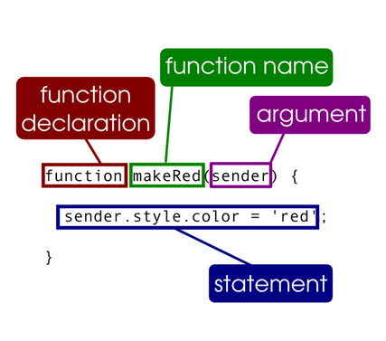
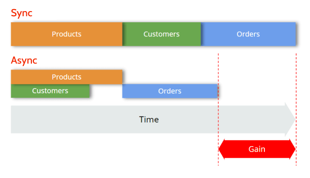
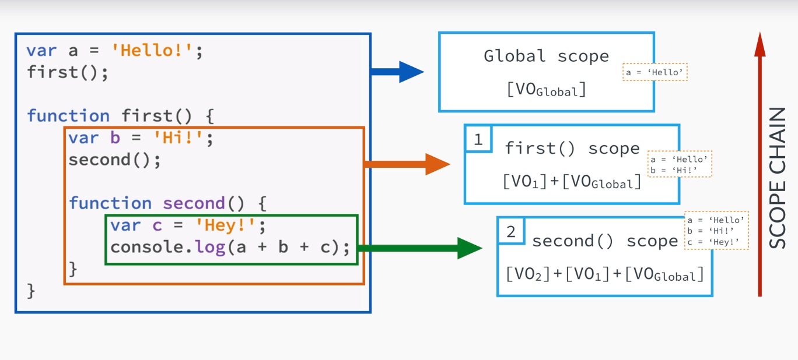

# JavaScript Functions and Callbacks

## Excercises

    - go to script.js
    - to run the script type node script.js

1. [Callbacks](/excercises/callbacks.md)
2. [Callbacks (with map, filter and forEach)](/excercises/mapfilter.md)
3. [Error Handling](/excercises/errorhandling.md)
4. [Asynchronous Callbacks](/excercises/asynchronousCallbacks.md)
5. [this keyword](/excercises/this.md)

 

## What are JavaScript functions?

<figure>
    
    <figcaption><em>Overview over a JS function</em></figcaption>
</figure>

Functions are one of the fundamental building blocks in JavaScript. A function in JavaScript is similar to a procedure—a set of statements that performs a task or calculates a value, but for a procedure to qualify as a function, it should take some input and return an output where there is some obvious relationship between the input and the output. To use a function, you must define it somewhere in the scope from which you wish to call it.

    function square(number) {
    return number * number;
    }

 

## What are JavaScript callbacks?

A callback function is a function passed into another function as an argument, which is then invoked inside the outer function to complete some kind of routine or action.

    function filter(numbers, callback) {
    let results = [];
    for (const number of numbers) {
        if (callback(number)) {
        results.push(number);
        }
    }
    return results;
    }

    let numbers = [1, 2, 4, 7, 3, 5, 6];

    let oddNumbers = filter(numbers, function (number) {
    return number % 2 != 0;
    });

    console.log(oddNumbers);

 

## Asynchronous vs. Synchronous Programming

In **synchronous** operations tasks are performed one at a time and only when one is completed, the following is unblocked. In other words, you need to wait for a task to finish to move to the next one.

In **asynchronous** operations, on the other hand, you can move to another task before the previous one finishes. This way, with asynchronous programming you’re able to deal with multiple requests simultaneously, thus completing more tasks in a much shorter period of time

<figure>
    
    <figcaption><em>Asynchronous vs. Synchronous Programming</em></figcaption>
</figure>

## this keyword

**Function context**

In JavaScript, the this keyword refers to an object. Which object depends on how this is being invoked (used or called). The this keyword refers to different objects depending on how it is used:

- In an object method, this refers to the object.
- Alone, this refers to the global object.
- In a function, this refers to the global object.
- In a function, in strict mode, this is undefined.
- In an event, this refers to the element that received the event.
- Methods like call(), apply(), and bind() can refer this to any object.

## Scope Chain

**Scoping answers the question: " Where can we access a certain variable"?**

- Each new function creates a scope: the space/enviroment, in which the variables it defines are accessible.
- Lexical scoping: a function that is lexically within another function gets access to the scope of the outer function.

<figure>
    
    <figcaption><em>Scope Chain</em></figcaption>
</figure>

- One thing to remember is, at the scope chain doesn't work the other way around. The global scope will not have access to the variable b or c, unless the function returns them.

**Lexical scoping** (sometimes known as static scoping ) is a convention used with many programming languages that sets the scope (range of functionality) of a variable so that it may only be called (referenced) from within the block of code in which it is defined. The scope is determined when the code is compiled. A variable declared in this fashion is sometimes called a private variable.

The opposite approach is known as **dynamic scoping** . Dynamic scoping creates variables that can be called from outside the block of code in which they are defined. A variable declared in this fashion is sometimes called a public variable.
