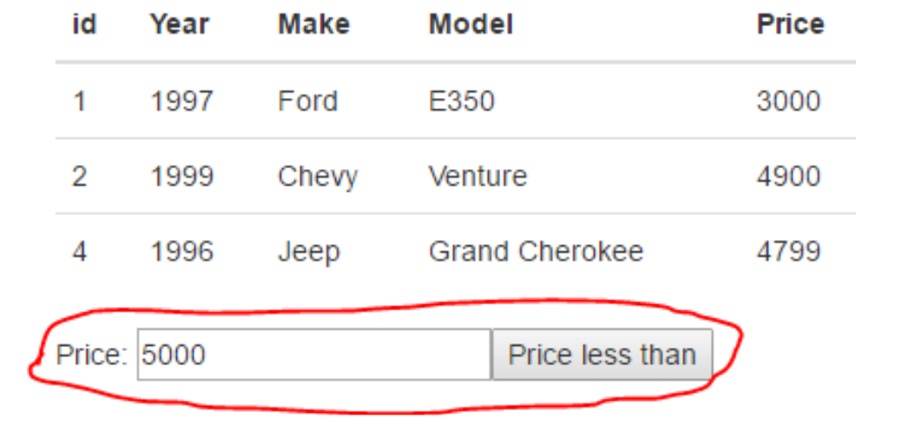

# Dom Manipulation and Events

## Simple DOM manipulation and Event handling

1. Add three divs to an HTML page, each with a unique id

2. When the page initially is loaded all divs should be given a colour of your choice. Hints: use document.querySelectorAll() (will return an array of Dom Nodes) and element.style.backgroundColor 

3. Add a button, and assign a click handler to the button. When the button is clicked each div should be given a unique colour. Hints: use document.querySelector(..) to get the individual div’s.

## Event Bubbling and event arguments

4. In a new HTML page add two div’s, each with a unique id. Style both id’s with this class: 

        .mydiv {
            width: 25px; 
            height: 25px;
            background-color:yellow; 
            margin:1px;
        }

5. Add a click handler to each id and write code, so when clicked, each div will write to the console "Hi from idOfTheDiv".

6. Now, using cut and paste, add 10 more divs (still each with a unique id).

7. Adding an event handler to each div would be cumbersome and non-efficient (what if you had been asked to add 100 or thousands of new id’s). We will use JavaScript's event bubbling mechanism to solve this with only a single event handler. Add a new div with the **id="outer"** around all our div’s and assign a single click eventhandler (with the event argument) to this div.

8. Implement code to write to the console:
    - The value of id pointed to by the target property (which you get from the event argument)
    
**Hint:** function (e) { const target = e.target}
Make sure you understand what happened here.

9. Add an empty paragraph tag, with an id, to your HTML and change the code for both exercises above, so that output is not written to the console, but into this paragraph.

**Hint:** Use the innerText property of an Element

## Using map to create list’s (ul’s, tables etc.)

**Use carsTable.html for solving this excercise. It includes Bootstrap in the html header for html Table styling.**

Yesterday you used the array types map and join methods to create a \<ul>\</ul> (unsorted list) with a number of names. 

10. Use this function+DOM manipulation to insert the \<ul>\</ul> somewhere in an HTML page. 

11. Create a FORM with an input field + a submit button as sketched here.

<figure>
    
    <figcaption><em>JS form</em></figcaption>
</figure>

12. Write the necessary code to add the new name to the array of names, and regenerate the \<ul> with the updated list.

**Hint:** You will probably see, very shortly that the name is added, the screen flickers and it's gone again.
The problem is that it submits to the server, so the full page is reloaded.To prevent this you can call preventDefault() on the event argument which will prevent the default behaviour (submit) and it should work.

You can also use preventDefault() to prevent a link from actually forwarding to the link-address.

13. Add two more buttons to the form with the text:  **“remove first”** and  **“remove last”**. Implement the behaviour inspired by how you solved part-b.

## Using map and filter to create dynamic table-rows

Yesterday you created a number of filter functions using the array given below.

    var cars = [
    { id: 1, year: 1997, make: 'Ford', model: 'E350', price: 3000 },
    { id: 2, year: 1999, make: 'Chevy', model: 'Venture', price: 4900 },
    { id: 3, year: 2000, make: 'Chevy', model: 'Venture', price: 5000 },
    { id: 4, year: 1996, make: 'Jeep', model: 'Grand Cherokee', price: 4799 },
    { id: 5, year: 2005, make: 'Volvo', model: 'V70', price: 44799 }
    ];

Use this array, with map and filter as outlined in the following:

14. Use the map  method to create a table with all data
Write a function which, given this array, will return an HTML string with the array formatted as a Table as sketched in this figure.

<figure>
    
    <figcaption><em>Cars Table</em></figcaption>
</figure>

15. Use the filter method, to filter out items from the list and add an input field and a button (provide each with an id), as sketched in this figure below.
Write the necessary code so when the button is clicked, and the input field contains a number:

* A new filtered array is created having only prices < than the value provided
* This array is passed to the function implemented in the previous step, and the DOM is updated with this new table.

<figure>
    
    <figcaption><em>Filter Cars Table</em></figcaption>
</figure>

## Implement a simple calculator

Implement a calculator with the functionality given below.

1. When a button is clicked the value should be appended to the display div (middle figure).
2. When the equal sign is clicked, the result of the calculation must be presented. (last figure).

<figure>
    
    <figcaption><em>Calculator</em></figcaption>
</figure>

3. Go to calculator.html to get started:

**Hints (and these are just hints, there are many ways to solve this problem)** 

* Assign a single click event handler to the div with the buttons id to handle anything but the “=” button.
* Use your knowledge about event bubbling and the events target property to get the text in the div that was clicked (via the innerText property).
* Assign a new event handler to the div with the “calculate” id. Use the event arguments .stopPropagation() method, to prevent this event from bubbling up to your “outer” event handler.
* To the calculation:
    - Use the indexOff(..) method to test whether a string contains *, /, + or -.
    - Use split(..) (with one of the four operators) to get the two numeric values and use Number(..) to convert a numeric string into a number before you do the calculation.
    - Alternatively, use the eval() function to evaluate the expression
